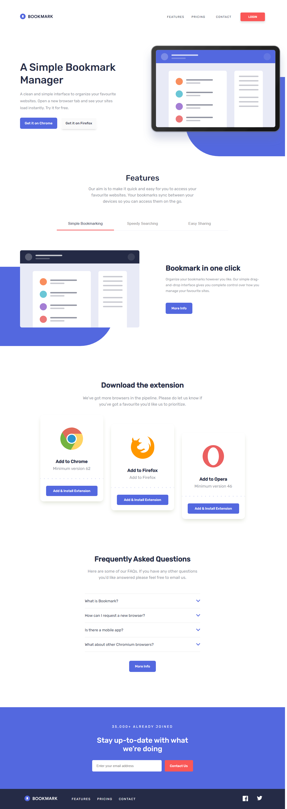

# Frontend Mentor - Bookmark landing page solution

## Table of contents

-  [Overview](#overview)
   -  [The challenge](#the-challenge)
   -  [Screenshot](#screenshot)
   -  [Links](#links)
-  [My process](#my-process)
   -  [Built with](#built-with)
   -  [What I learned](#what-i-learned)
   -  [Continued development](#continued-development)
   -  [Useful resources](#useful-resources)
-  [Author](#author)

## Overview

### The challenge

Users should be able to:

-  View the optimal layout for the site depending on their device's screen size
-  See hover states for all interactive elements on the page
-  Receive an error message when the newsletter form is submitted if:
   -  The input field is empty
   -  The email address is not formatted correctly

### Screenshot

### Links

-  Solution URL: [Add solution URL here](https://your-solution-url.com)
-  Live Site URL: [Add live site URL here](https://github.com/benjoquilario/fem-bookmark-landing-page)

## My process

### Built with

-  Semantic HTML5 markup
-  BEM methodology
-  React JS
-  JSX
-  SCSS for css preprocessor
-  CSS 3
-  Flexbox
-  CSS Grid
-  Mobile-first workflow
-  [React](https://reactjs.org/) - JS library

### What I learned

While building this project I learned more about React JS. I learned how to used sass using react JS by installing `sass` dependencies, and more importantly I learned how to used a reusable components.

### Continued development

Need to continued learning more about useEffects and useRefs

### Useful resources

-  [React](https://reactjs.org/) - documentation

## Author

-  Frontend Mentor - [@yourusername](https://www.frontendmentor.io/profile/benjoquilario)
-  Twitter - [@iam_benjo](https://www.twitter.com/iam_benjo)

## Acknowledgments

This is where you can give a hat tip to anyone who helped you out on this project. Perhaps you worked in a team or got some inspiration from someone else's solution. This is the perfect place to give them some credit.
